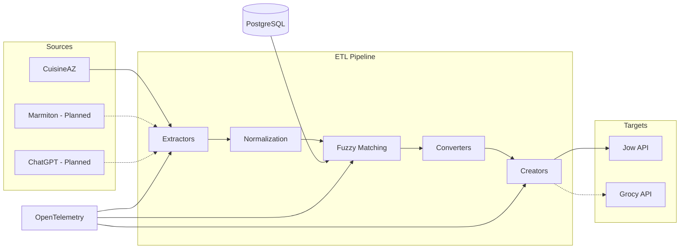
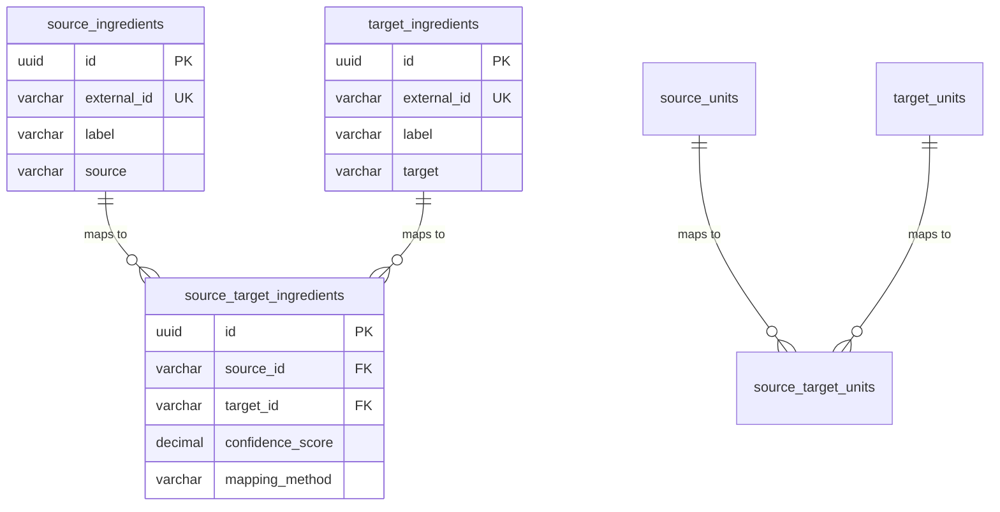

# Scrapicook - Architecture

## System Overview

Scrapicook follows an ETL pipeline architecture with a layered design pattern and Factory pattern for extensibility.



## Source Code Structure

```
src/
├── app.ts                    # Fastify app configuration with autoload
├── server.ts                 # Server entry point with AJV validation
├── logger.ts                 # Logging configuration
├── metric.ts                 # OpenTelemetry setup
│
├── controllers/              # HTTP endpoints
│   └── recipe/
│       ├── extract.controller.ts
│       ├── interfaces/       # Request/Response types
│       └── schemas/          # JSON Schema validation
│
├── services/                 # Business logic orchestration
│   ├── recipe/
│   │   ├── recipe-extract.ts # Main extraction flow
│   │   ├── recipe-parser.ts  # Page to Recipe conversion
│   │   └── recipe-creator.ts # Recipe publishing
│   └── enums/                # Available extractors/converters/creators
│
├── factories/                # Factory pattern implementations
│   ├── recipe-extractor-factory.ts
│   ├── recipe-converter-factory.ts
│   └── recipe-creator-factory.ts
│
├── extractors/               # Source-specific extractors
│   ├── common/
│   │   └── recipeSource.extractor.ts
│   ├── cuisineaz/            # CuisineAZ implementation
│   │   ├── recipe-extractor.ts
│   │   ├── title.extractor.ts
│   │   ├── ingredient.extractor.ts
│   │   ├── step.extractor.ts
│   │   └── ...
│   └── interfaces/           # Extractor contracts
│
├── converters/               # Target-specific converters
│   ├── jow.converter.ts
│   └── interfaces/
│       └── AbstractConverter.interface.ts
│
├── creators/                 # Target platform creators
│   ├── jow/
│   │   └── recipe-creator.ts
│   ├── grocy/                # Planned
│   └── interfaces/
│
├── models/                   # Domain models with convert capability
│   ├── recipe/
│   ├── ingredient/
│   ├── step/
│   ├── title/
│   ├── cooktime/
│   ├── image/
│   ├── astuce/
│   ├── numberOfPerson/
│   └── recipe-source/
│
├── queries/                  # External API calls
│   └── jow/
│       ├── jow.queries.ts
│       └── interfaces/
│
├── database/                 # Prisma client
│   ├── prismaClient.ts
│   └── seed.ts
│
├── otel/                     # Observability
│   ├── otel-setup.ts
│   └── Instrumentation.ts
│
└── plugins/                  # Fastify plugins
```

## Key Design Patterns

### 1. Factory Pattern
Three factories enable extensibility for new sources/targets:
- [`recipeExtractorFactory`](src/factories/recipe-extractor-factory.ts) - Selects extractor based on URL source
- [`recipeConverterFactory`](src/factories/recipe-converter-factory.ts) - Selects converter based on target
- [`recipeCreatorFactory`](src/factories/recipe-creator-factory.ts) - Selects creator based on target

### 2. Strategy Pattern - Models with Convert Capability
Each model implements [`IConvertibleAbstract`](src/models/interfaces/modelAbstract.interface.ts:7) allowing:
```typescript
Recipe.get().title.convert(AvailableCreatorRecipeEnum.JOW)
```

### 3. Interface Segregation
```typescript
interface IModelAbstract<T> { get(): T }
interface IConvertibleAbstract { convert(availableConverter): any }
type IModelWith<T, Capabilities> = IModelAbstract<T> & Capabilities
```

## Database Schema

Multi-schema PostgreSQL design for source/target separation:



### Schemas
- `source` - Ingredients/units from source platforms (Grocy)
- `target` - Ingredients/units for target platforms (Jow, Grocy)
- `public` - Mapping tables with confidence scores

### Mapping Methods
Defined in [`MappingMethod`](prisma/schema.prisma:119) enum:
- `HUMAN` - Manual mapping
- `FUZZY_V1` - Fuzzy matching algorithm
- `CHAT_GPT` - AI-assisted mapping

## Data Flow

### Extraction Flow
1. Controller receives URL via `/extract` endpoint
2. Service launches Playwright browser
3. Factory selects appropriate extractor based on URL domain
4. Extractor scrapes page using CSS selectors
5. Data assembled into `RecipeModel`

### Conversion Flow
1. `RecipeModel.convert(target)` called
2. Factory returns appropriate converter
3. Converter transforms each model component
4. Returns target-specific format (e.g., `IJowCreateRecipeBody`)

## Critical Implementation Notes

### CuisineAZ Selectors
Current implementation uses:
- `.recipe-title` - Title
- `.ingredient_list .ingredient_item` - Ingredients
- `.preparation_steps .preparation_step p` - Steps

### Jow API Constraints
- Title: max 50 characters
- Tip: max 350 characters
- Step description: max 350 characters
- Truncation applied with warning logs

### @todo Items in Code
- Ingredient list conversion not implemented
- Unit conversion not implemented
- Grocy creator not implemented
- Jow API call commented out (auth pending)
