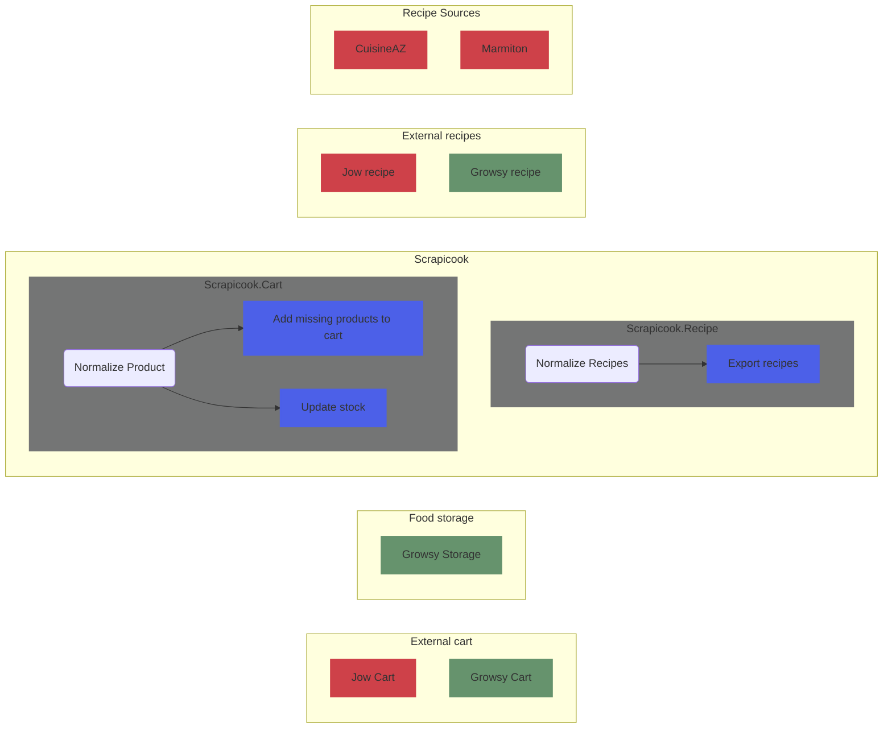
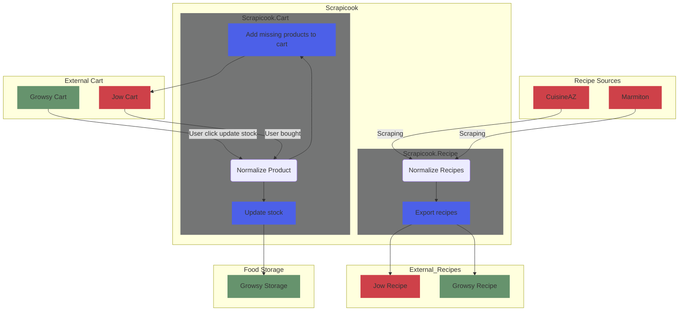
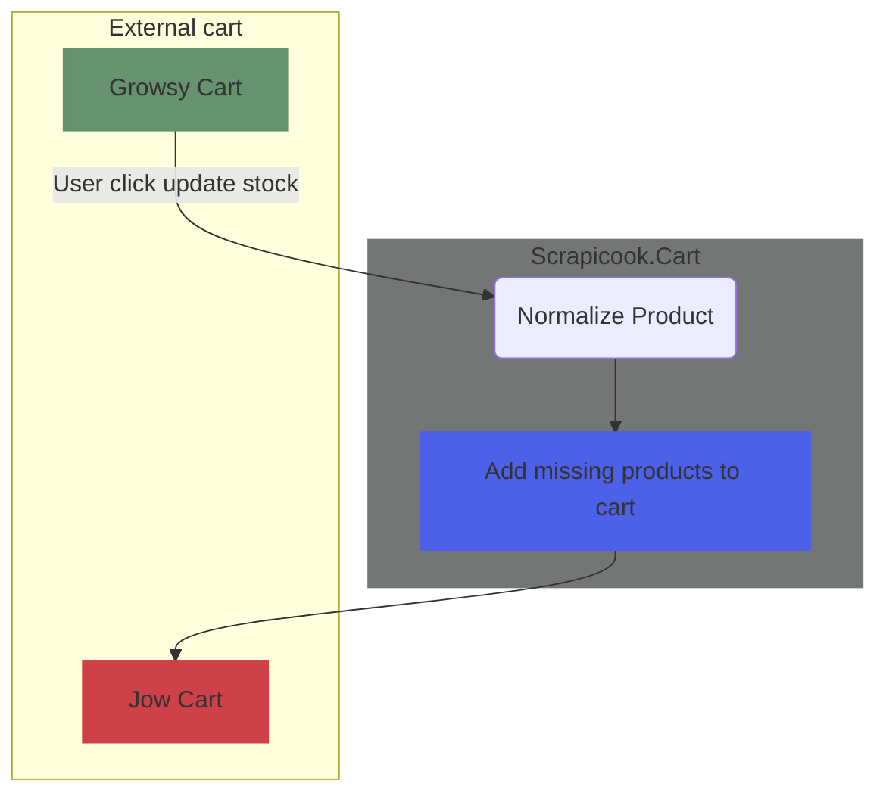
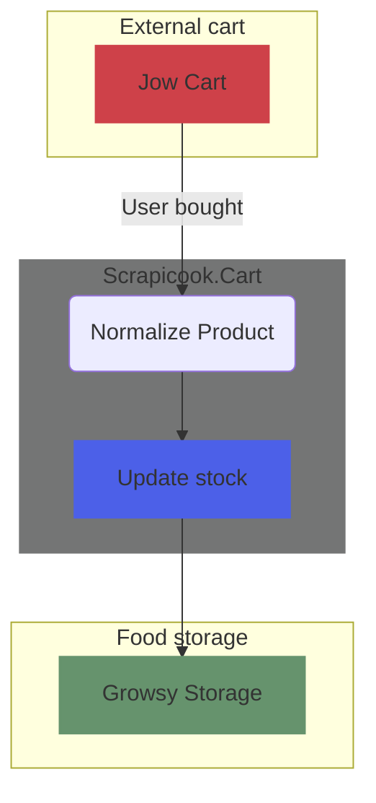
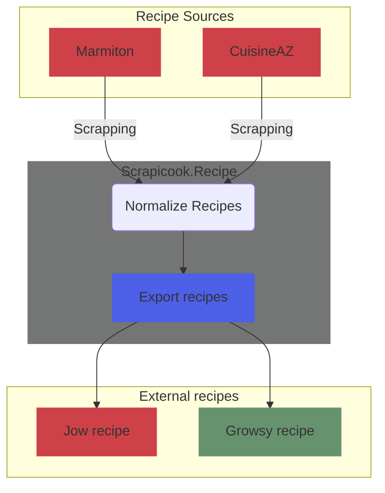

## Dependencies

```mermaid
graph LR
    %% colors
    style Scrapicook.Cart fill:#747575,stroke:#747575,stroke-width:2px
    style Scrapicook.Recipe fill:#747575,stroke:#747575,stroke-width:2px

    style ADD_CART fill:#4C60E8,stroke:#4C60E8,stroke-width:2px
    style EXPORT fill:#4C60E8,stroke:#4C60E8,stroke-width:2px
    style UPDATE fill:#4C60E8,stroke:#4C60E8,stroke-width:2px
    
    style JOW_CART fill:#CE4149,stroke:#CE4149,stroke-width:2px
    style JOW_RECIPE fill:#CE4149,stroke:#CE4149,stroke-width:2px
    
    style CAZ fill:#CE4149,stroke:#CE4149,stroke-width:2px
    style MAR fill:#CE4149,stroke:#CE4149,stroke-width:2px
    
    style GSY_CART fill:#66936D,stroke:#66936D,stroke-width:2px
    style GSY_STOCK fill:#66936D,stroke:#66936D,stroke-width:2px
    style GSY_RECIPE fill:#66936D,stroke:#66936D,stroke-width:2px

    %% subgraph
    
    subgraph External cart
        GSY_CART[Growsy Cart]
        JOW_CART[Jow Cart]
    end
    subgraph Food storage
        GSY_STOCK[Growsy Storage]
    end

    subgraph Scrapicook
        subgraph Scrapicook.Recipe
            NORMALIZE_RECIPE(Normalize Recipes)
            EXPORT[Export recipes]
        end

        subgraph Scrapicook.Cart
            NORMALIZE(Normalize Product)
            ADD_CART[Add missing products to cart]
            UPDATE[Update stock]
        end
    end

    subgraph External_recipe[External recipes]
        GSY_RECIPE[Growsy recipe]
        JOW_RECIPE[Jow recipe]
    end


    subgraph Recipe Sources
        CAZ[CuisineAZ]
        MAR[Marmiton]
    end
    
    NORMALIZE --> ADD_CART
    NORMALIZE --> UPDATE
    NORMALIZE_RECIPE --> EXPORT
```

```mermaid
graph TD
    %% Styles
    style Scrapicook.Cart fill:#747575,stroke:#747575,stroke-width:2px
    style Scrapicook.Recipe fill:#747575,stroke:#747575,stroke-width:2px

    style ADD_CART fill:#4C60E8,stroke:#4C60E8,stroke-width:2px
    style EXPORT fill:#4C60E8,stroke:#4C60E8,stroke-width:2px
    style UPDATE fill:#4C60E8,stroke:#4C60E8,stroke-width:2px

    style JOW_CART fill:#CE4149,stroke:#CE4149,stroke-width:2px
    style JOW_RECIPE fill:#CE4149,stroke:#CE4149,stroke-width:2px
    style CAZ fill:#CE4149,stroke:#CE4149,stroke-width:2px
    style MAR fill:#CE4149,stroke:#CE4149,stroke-width:2px

    style GSY_CART fill:#66936D,stroke:#66936D,stroke-width:2px
    style GSY_STOCK fill:#66936D,stroke:#66936D,stroke-width:2px
    style GSY_RECIPE fill:#66936D,stroke:#66936D,stroke-width:2px

    %% Scrapicook - Normalization
    subgraph Scrapicook
        subgraph Scrapicook.Recipe
            NORMALIZE_RECIPE(Normalize Recipes)
            EXPORT[Export recipes]
        end
        subgraph Scrapicook.Cart
            NORMALIZE(Normalize Product)
            ADD_CART[Add missing products to cart]
            UPDATE[Update stock]
        end
    end

    %% External sources - recipes
    subgraph Recipe Sources
        CAZ[CuisineAZ]
        MAR[Marmiton]
    end
    subgraph External_Recipes
        GSY_RECIPE[Growsy Recipe]
        JOW_RECIPE[Jow Recipe]
    end

    %% External tools - cart / stock
    subgraph External Cart
        GSY_CART[Growsy Cart]
        JOW_CART[Jow Cart]
    end
    subgraph Food Storage
        GSY_STOCK[Growsy Storage]
    end

    %% Dependencies & interactions
    CAZ -->|Scraping| NORMALIZE_RECIPE
    MAR -->|Scraping| NORMALIZE_RECIPE
    NORMALIZE_RECIPE --> EXPORT
    EXPORT --> GSY_RECIPE
    EXPORT --> JOW_RECIPE

    GSY_CART -->|User click update stock| NORMALIZE
    JOW_CART -->|User bought| NORMALIZE
    NORMALIZE --> ADD_CART
    NORMALIZE --> UPDATE
    ADD_CART --> JOW_CART
    UPDATE --> GSY_STOCK
```

## Add to cart

```mermaid
graph TD
    %% colors
    style JOW_CART fill:#CE4149,stroke:#CE4149,stroke-width:2px
    style ADD_CART fill:#4C60E8,stroke:#4C60E8,stroke-width:2px
    style Scrapicook.Cart fill:#747575,stroke:#747575,stroke-width:2px

    style GSY_CART fill:#66936D,stroke:#66936D,stroke-width:2px

    %% subgraph
    subgraph Scrapicook.Cart
        NORMALIZE(Normalize Product)
        ADD_CART[Add missing products to cart]
    end
    
    subgraph External cart
        GSY_CART[Growsy Cart]
        JOW_CART[Jow Cart]
    end
    
    GSY_CART -->|User click update stock| NORMALIZE
    NORMALIZE --> ADD_CART
    ADD_CART --> JOW_CART
```

## Storage

```mermaid
graph TD
    %% colors
    style JOW_CART fill:#CE4149,stroke:#CE4149,stroke-width:2px
    style UPDATE fill:#4C60E8,stroke:#4C60E8,stroke-width:2px
    style Scrapicook.Cart fill:#747575,stroke:#747575,stroke-width:2px

    style GSY_STOCK fill:#66936D,stroke:#66936D,stroke-width:2px

    %% subgraph
    subgraph Scrapicook.Cart
        NORMALIZE(Normalize Product)
        UPDATE[Update stock]
    end
    
    subgraph External cart
        JOW_CART[Jow Cart]
    end

    subgraph Food storage
        GSY_STOCK[Growsy Storage]
    end

    JOW_CART -->|User bought| NORMALIZE
    NORMALIZE --> UPDATE
    UPDATE --> GSY_STOCK
```

## Recipe

```mermaid
graph TD
    %% colors
    style CAZ fill:#CE4149,stroke:#CE4149,stroke-width:2px
    style MAR fill:#CE4149,stroke:#CE4149,stroke-width:2px
    style JOW_RECIPE fill:#CE4149,stroke:#CE4149,stroke-width:2px
    style Scrapicook.Recipe fill:#747575,stroke:#747575,stroke-width:2px
    style EXPORT fill:#4C60E8,stroke:#4C60E8,stroke-width:2px

    style GSY_RECIPE fill:#66936D,stroke:#66936D,stroke-width:2px

    %% subgraph
    subgraph Recipe Sources
        CAZ[CuisineAZ]
        MAR[Marmiton]
    end

    subgraph Scrapicook.Recipe
        NORMALIZE_RECIPE(Normalize Recipes)
        EXPORT[Export recipes]
    end
    
    subgraph External_recipe[External recipes]
        GSY_RECIPE[Growsy recipe]
        JOW_RECIPE[Jow recipe]
    end

    %% Sources
    MAR -->|Scrapping| NORMALIZE_RECIPE
    CAZ -->|Scrapping| NORMALIZE_RECIPE
    
    %% Features
    NORMALIZE_RECIPE --> EXPORT

    %% Destination
    EXPORT --> GSY_RECIPE
    EXPORT --> JOW_RECIPE
```

