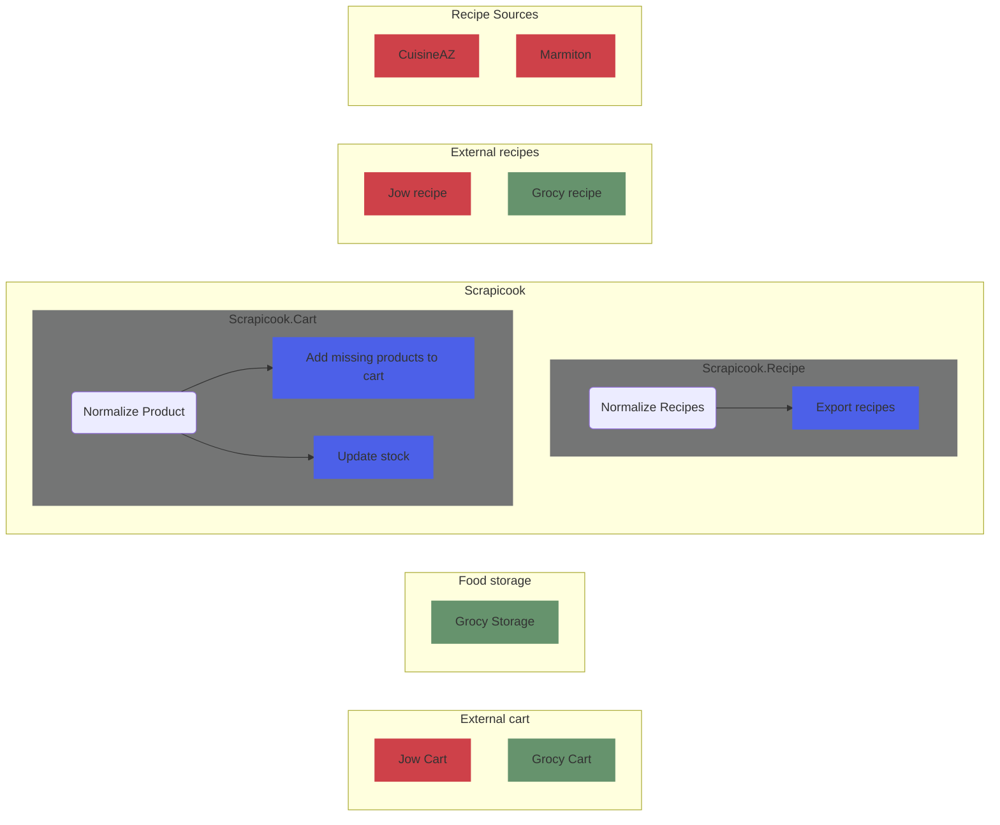
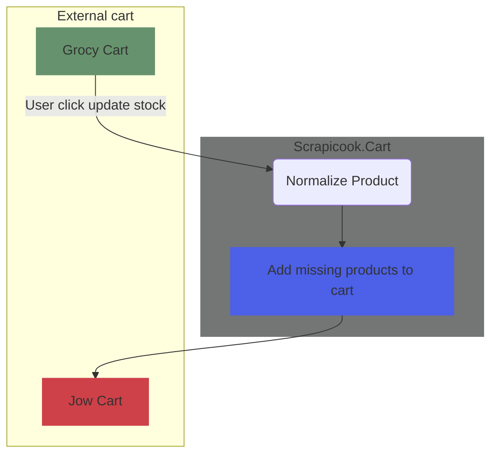
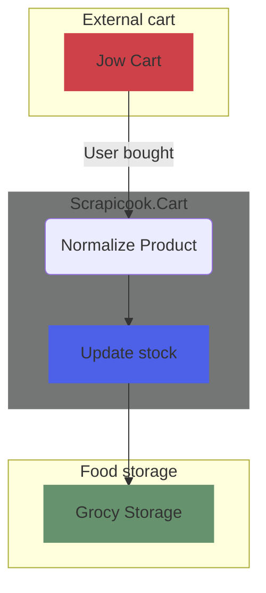
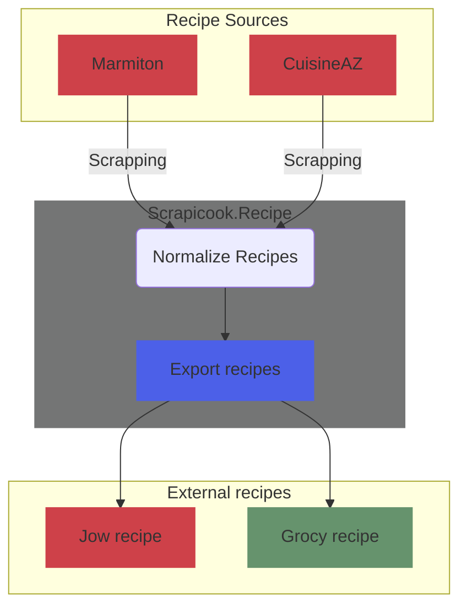

# Scrapicook

## Objectifs
1. Convertir automatiquement des recettes trouvées sur des sites de recettes en ligne (comme CuisineAZ ou Marmiton, ou on pourrait même penser à une génération des recettes par chatGPT aussi...) en recettes target (comme Jow, Grocy...) en passant par **Grocy** comme source of truth pour les ingrédients et les unités de mesures.
   - Intéret de **Jow**: 
     - Jow permet de générer une liste de courses sur les supermarchés (intermarché, auchan...) à partir d'une recette. L'intelligence de Jow serait fastidieux à reproduire.
   - Intéret de **Grocy**:
     - Grocy permet de gérer un stock de produits alimentaires. Il permet aussi de gérer les dates de péremption, les quantités, etc.
     - Grocy permet de consommer directement toute une liste de produits d'une recette, et de mettre à jour le stock en conséquence. D'où l'intérêt de généré les recettes AUSSI dans Grocy.
     - Grocy permet de connaitre mon stock de produits. Grace à cela je pourrai savoir quels sont les produits récurrent manquants, et ainsi les ajouter automatiquement à ma liste de courses.
2. Ajouter automatiquement les produits manquants à ma liste de courses Jow. Exemple: Je souhaite avoir minimum 1500g de pâtes, si dans le stock il m'en reste 500g: ajout 1000g au panier Jow. La partie détection du minimum est pris en charge par Grocy, la partie ajout au panier Jow est géré par ce projet. 
3. Mettre à jour mon stock de produits dans Grocy lorsque j'achète des produits dans Jow.

# Flow principal
1. Extractors: get `source_recipe`
   - Extraction des ingrédients depuis le JSONLD ou HTML / contenu de la recette source (CuisineAZ, Marmiton, chatGPT, etc.)
   - Si une donnée de cette recette n'est pas trouvée, créer un log de warn qui sera stocké avec la stack `otel-lgtm` pour analyse ultérieure. Le warn sera de type: `{type: "recipe", label: "cuisineaz", element:"quantity", url:"www...""}` pour signaler que la quantité n'a pas été trouvée dans la recette source.
     - Ajout manuel des ingrédients manquants dans Grocy grâce à un dashboard Grafana.
2. Normalization: convert `source_recipe` to `normalized_recipe`
   - Standardisation du format de la recette (titre, ingrédients, quantités, unités de mesure, etc.) dans l'intérêt de pouvoir les exporter vers d'autres recettes target (Grocy, Jow)
3. Fuzzy Matching: match `normalized_recipe` with `truth_recipe` (grocy)
   - Depuis la **base de donnée Grocy**, mappe les ingrédients des recettes source avec les ingrédients de Grocy (ma source of truth pour les ingrédients et les unités de mesure).
   - Si l'ingrédient ou l'unité de mesure n'existe pas dans Grocy, créer un log de warn qui sera stocké avec la stack `otel-lgtm` pour analyse ultérieure. Le warn sera de type: `{type: "ingredient", label: "aubergine"}` pour signaler que le fuzzy match n'a trouvé aucun ingrédient `aubergine` dans la database de grocy.
     - Ajout manuel des ingrédients manquants dans Grocy grâce à un dashboard Grafana.
     - L'ingrédient ou l'unité manquant sera supprimé de la recette normalisée. @todo: trouver un meilleur moyen de gérer les ingrédients manquants.
4. Creators: convert `truth_recipe` to `target_recipe` (Jow, Grocy, etc.)
   - Création de la recette target (Grocy et Jow, etc.) à partir de la recette normalisée et mappé.
   - Depuis ma **base de donnée de mapping**, mappe les ingrédients de la recette normalisée avec les ingrédients la recette target.
   - Si l'ingrédient ou l'unité de mesure n'existe pas dans la recette target, créer un log de warn qui sera stocké avec la stack `otel-lgtm` pour analyse ultérieure. Le warn sera de type: `{type: "ingredient", label: "gcy_steak", target: "jow"}` pour signaler qu'il manque un mapping entre `gcy_steak` et le `steak` de jow.
     - Tente un fuzzy match avec l'ingrédient Grocy manquant et l'ingrédient target manquant dans une base de donnée d'ingrédient target (avec un score >= 70%).
     - Si le fuzzy match est trouvé, ajoute l'ingrédient manquant dans la base de donnée de mapping.
     - Sinon ajoute un log de warn dans la stack `otel-lgtm` pour analyse ultérieure. Le warn sera de type: `{type: "ingredient", label: "gcy_steak", target: "jow"}` pour signaler que le fuzzy match n'a trouvé aucun ingrédient `gcy_steak` et le `steak` de jow.
5. La recette est créer !

## Schema

[Edit schema](https://miro.com/app/board/uXjVIsGko4s=/?moveToWidget=3458764630801161729&cot=14)

## Dependencies

## Add to cart

## Storage

## Recipe

